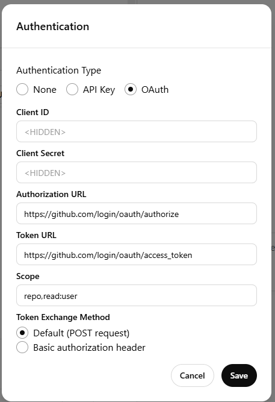
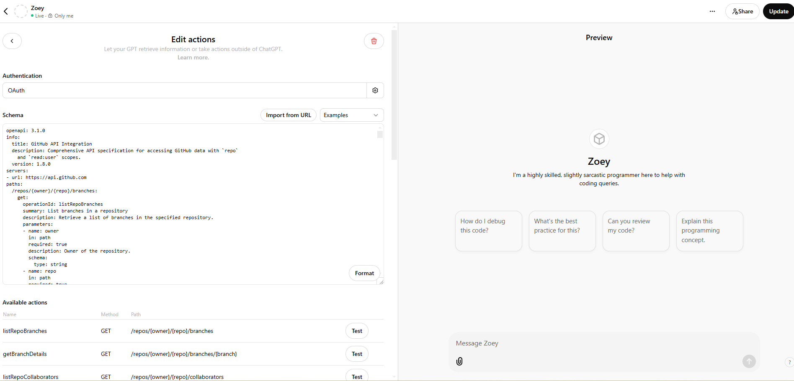
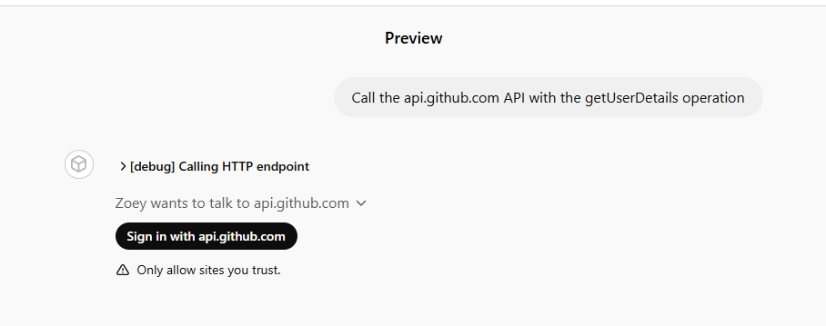

# GitHub ChatGPT Actions

This repository provides an OpenAPI specification for GitHub's API with `repo` and `read:user` scopes to enable a custom GPT to access private repositories. The integration currently supports **GET** requests only, allowing for read-only functions.

Follow this guide to set up and test the integration.

---

## Prerequisites

1. **A GitHub account** with access to the required repositories.
2. **ChatGPT Pro Access** to configure a GPT.

---

## Setup Guide

### Step 1: Create a New GitHub App

1. Go to the [GitHub App Settings](https://github.com/settings/apps).
2. Click on `New GitHub App`.
3. Configure the app with:
   - **Permissions**: Include `read:user` and `repo` (with read-only access).
   - **Callback URL**: Use the URL provided in the ChatGPT GPT actions configuration.
   - **Webhook URL**: Leave blank if not required.

---

### Step 2: Create a GPT or Use an Existing One

1. Navigate to [Your GPTs](https://chat.openai.com/gpts/mine).
2. Create a new GPT or select an existing one.
3. Click `Configure` to start setting up custom actions.

---

### Step 3: Add OAuth Configuration in ChatGPT

1. In the `Configure` section, click on `Create New Action`.
2. Select **OAuth** under `Authentication`.
3. Enter the following details:
   - **Client ID**: Retrieve this from the GitHub App settings.
   - **Client Secret**: Copy it from the GitHub App settings.
   - **Authorization URL**: `https://github.com/login/oauth/authorize`
   - **Token URL**: `https://github.com/login/oauth/access_token`
   - **Scope**: `repo,read:user`
   - **Token Exchange Method**: Use `Default (POST request)`.

4. Save your configuration.

#### Reference Screenshot:

---

### Step 4: Import the OpenAPI Specification

1. Copy the OpenAPI YAML file provided in this repository.
2. Paste it into the schema editor under the `Edit Actions` section of your GPT configuration.
3. Click `Format` to validate the YAML schema.

---

### Step 5: Testing the Integration

1. Click on `Test` for any available endpoint (e.g., `/repos/{owner}/{repo}/branches`).
2. Authenticate with GitHub when prompted.
3. Verify the output to ensure it matches the expected API response.

#### Screenshots:
- **Full Setup Configuration**:

- **Testing Flow**:
Before authentication:

After authentication:

---

## Additional Resources

- [OAuth Client ID and Secret Documentation](https://www.oauth.com/oauth2-servers/client-registration/client-id-secret/)
- [GitHub API Documentation](https://docs.github.com/en/rest)

---

## Features

- Retrieve repository branches, tags, and commits.
- List collaborators, pull requests, and issues.
- Fetch repository contents, READMEs, and webhooks.

---

## Contributing

Feel free to open issues or create pull requests to improve the OpenAPI specification or this guide.

---

## License

[MIT License](LICENSE)
